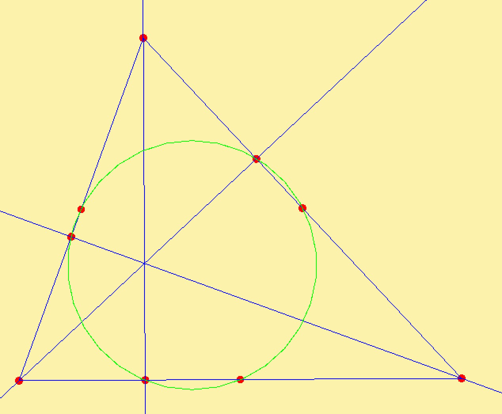

# Geometry Sketchpad

A dynamic geometry visualization program written in C++17 with SFML. Sketchpad is designed around olympiad geometry: constructions remain dependent on their defining objects, specialized triangle centers are built in, and GeoGenie can search a diagram for useful geometric relations.



## Key features

### Dynamic constructions

Sketchpad currently supports:

- Free points and points constrained to lines
- Segments and full lines
- Circles defined by two or three points
- Midpoints
- Line-line and line-circle intersections
- Perpendicular and parallel lines
- Angle bisectors
- Point and line reflections
- Incenter, excenter, and circumcenter constructions
- Numbered triangle centers `X(1)` through `X(10)`
- Conics through five points
- Cubics through nine points
- Isogonal conjugates

Constructions are stored as dependencies rather than only rendered coordinates. Moving a defining point rebuilds every dependent object. Deleting an object also removes constructions that depend on it while preserving valid indices for the remaining diagram.

### Triangle centers

The **Triangle Center** tool supports the first ten Encyclopedia of Triangle Centers entries:

| Number | Center |
| --- | --- |
| `X(1)` | Incenter |
| `X(2)` | Centroid |
| `X(3)` | Circumcenter |
| `X(4)` | Orthocenter |
| `X(5)` | Nine-point center |
| `X(6)` | Symmedian point |
| `X(7)` | Gergonne point |
| `X(8)` | Nagel point |
| `X(9)` | Mittenpunkt |
| `X(10)` | Spieker center |

Select three triangle vertices, enter the desired number, and press **Enter**. Degenerate triangles are rejected.

### GeoGenie

The **SEARCHER TACTIC** analyzes the current diagram for:

- Collinear point sets
- Concyclic point sets
- Concurrent line sets

GeoGenie groups equivalent results by geometric locus, so a large set of points on one circle produces one circle witness instead of every possible quadruple. Generated witnesses can be removed with the close button in the upper-right corner. While a point is dragged, witnesses are temporarily removed and recomputed once on release.

### Full-diagram inversion

The **Invert Diagram** tool creates a live-linked inversion in a new tab:

1. Construct the circle that will define the inversion.
2. Select **Invert Diagram**.
3. Click the inversion circle.

The generated tab updates whenever its source diagram changes. Points, full lines, and circles are inverted exactly. Lines through the inversion center remain lines, circles through the center become lines, and the inversion center itself is omitted because its image is at infinity.

### Tabs

- Create an empty tab with the **+** button.
- Duplicate the active tab with the overlapping-squares button.
- Drag tabs horizontally to reorder them.
- Rename a tab with its pencil control.
- Close a tab with its cross control.
- Closing a source diagram also closes its live-linked inversion tabs.
- Closing the final tab creates a fresh empty diagram.

Normal tab duplicates are independent. Duplicated inversion tabs remain linked to the same source.

### Labels and visibility

Points receive persistent labels automatically: `A` through `Z`, followed by `AA`, `AB`, and so on.

The toolbar provides:

- **Rename Point** to edit a selected point label
- **Hide Object** to hide a point, line, segment, or circle without deleting it
- **Hide Label** to hide only a point label
- **Show All** to restore hidden objects and labels

Labels and visibility settings are stored in the diagram protocol and propagate to live inversion views.

### Navigation and responsive layout

With the **Mouse** tool selected:

- Drag a movable point to update the construction.
- Drag empty canvas to pan the diagram.
- Scroll over the canvas to zoom around the cursor.

Each tab keeps an independent camera. Resizing the application reveals more or less canvas without scaling geometry, labels, tabs, or toolbar controls. Scroll over the left toolbar to reach tools that do not fit vertically.

## Protocol preview and `.sp` files

Sketchpad diagrams are JSON construction protocols, conventionally saved with the `.sp` extension. Each entry records the operation that created an object, its arguments, display metadata, and its position in construction order.

Use the triple-strip button in the upper-right corner to inspect the active protocol. The preview is scrollable and pretty-printed. An inversion tab displays its linked source protocol because the inverted view is generated dynamically.

The **Save** and **Open** toolbar actions write and read these protocol files. Opened files are rebuilt from their construction order, so dependencies remain dynamic.

## Controls

| Action | Control |
| --- | --- |
| Select or move a point | Mouse tool, then click or drag the point |
| Pan | Mouse tool, then drag empty canvas |
| Zoom | Scroll over the canvas |
| Delete selected object | **Delete** or **Backspace** |
| Scroll toolbar | Scroll over the left toolbar |
| Inspect protocol | Triple-strip button |
| Close protocol preview | Triple-strip button or **Escape** |
| Confirm text/number input | **Enter** |
| Cancel text/number input | **Escape** |
| Reorder a tab | Drag its title area |

## Building

### Requirements

- A C++17 compiler
- SFML 2.x with the graphics, window, system, and network libraries
- OpenGL
- macOS for the currently configured Makefile and framework flags

The checked-in Makefile currently references the Homebrew Apple Silicon SFML 2.6.1 paths under `/opt/homebrew/Cellar/sfml/2.6.1`. If SFML is installed elsewhere, update `INCLUDES` and `LIBS` in `Makefile`.

### Build and run

From the repository root:

```bash
make -j4
./main
```

The application loads fonts and textures through relative paths, so run it from the repository root.

To remove generated objects and the executable:

```bash
make clean
```

A `CMakeLists.txt` is also present, but its SFML include and library paths may need to be configured for the local installation.

## Project layout

```text
main.cpp                     Application loop, tabs, dialogs, and top-level UI
src/core/                    Geometry evaluation and algorithms
src/core/primitives/         Renderable geometric primitives
src/core/protocol/           JSON construction protocol and dependency deletion
src/geo_genie/               Relation search and property types
src/view/                    Toolbar and tool registration
gui_tools/                   SFML GUI widgets and layouts
filebrowser/                 Save/open file browser
examples/                    Example .sp diagrams
gui_assets/                  Fonts and GUI textures
```

## Current limitations

- Full-diagram inversion currently omits segments, conics, and cubics because their inverses are not generally represented by the existing exact primitive types.
- Live inversion tabs are generated read-only views; edit their source tab to update them.
- The numbered triangle-center catalog currently covers `X(1)` through `X(10)`.
- Build configuration is currently macOS/Homebrew-oriented and may require path changes on other systems.
- Sketchpad is under active development; malformed or degenerate constructions outside the guarded tools may still require additional handling.
